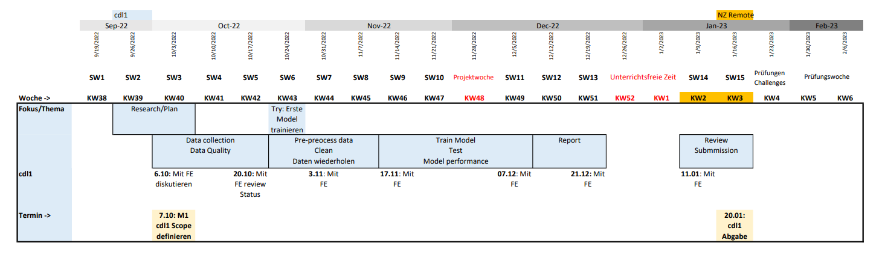

# Planung und Konzeption

### Welche Bewegungsprofile erkannt werden sollen und mit welcher erhofften Genauigkeit
Folgende Aktivitäten sollen aufgezeichnet und klassifiziert werden:
- Gehen / Laufen
- Joggen
- Sitzen / Stehen
- Velo fahren

Unsere Erwartung ist es, dass wir mit deep learning 90%  der Daten korrekt klassifizieren können. Ohne deep learning erwarten wir 80% korrekt klassifizierte Aktivitäten.

### Was genau im Projekt erreicht werden soll / was nicht

##### Scope:
Wir werden Daten mit unseren Smartphones sammeln und diese als CSV-Dateien ins Projekt einlesen. Dann werden wir mit diesen Daten unsere Modelle trainieren, welche wir dann mit weiteren CSV-Dateien überprüfen werden.

Wir wollen uns explorativ einen Überblick über die Daten verschaffen und die verschiedenen Bewegungsprofile explorativ vergleichen. Auch wollen wir so den Effekt der verschiedenen Smartphone-Positionen auf die aufgezeichneten Daten überprüfen.

Wir wollen Modelle vergleichen, welche Daten von verschiedenen Sensoren nutzen und wollen herausfinden wie viele Daten wirklich nötig sind, um ein performantes Modell zu trainieren. Wir wollen auch verschiedene Modelle vergleichen und am Ende ein Modell mit deep learning und ein Modell ohne deep learning auswählen. 

Wir haben uns entschieden unsere Daten mit einer Frequenz von genau 100 Hz aufzuzeichnen. Dies gibt uns sicher eine sehr gute Datengrundlage, ist jedoch evtl. total übertrieben. Evtl. führt die hohe Frequenz der Daten nur zu mehr Noise und mehr Batterieverbrauch. Deshalb wollen wir testen, welchen Effekt die Aufzeichnungsfrequenz auf unsere Modelle hat. Dafür werden wir einfach jeden x-ten Punkt in aus unseren Datensätzen nutzen um eine tiefere Aufzeichnungsfrequenz zu simulieren. Die hat sogar den positiven Nebeneffekt, dass wir dadurch x mal mehr Trainingsdaten haben.

##### Out of Scope:
Grundsätzlich wollen wir das Smartphone nur in einer Position am Körper haben (Hosentasche, Arm, ...) Am Anfang wollen wir herausfinden, welche Position zu den besten Daten führt und dann alle Trainingsdaten mit dem Smartphone in dieser Position aufzeichnen.

Wir haben uns ebenfalls dagegen entschieden eine Smartphone Applikation mit Echtzeit-Daten-Klassifikation zu erstellen. Da wir beide keine Erfahrung im Entwickeln von Smartphone Applikationen haben, scheint uns der Aufwand dafür zu gross.

Wir werden auch nur Trainingsdaten von zwei Personen haben, was beim Modell vermutlich einen negativen Effekt auf die generalisierbarkeit haben wird.

### Was es für Milestones gibt und wann diese etwa erreicht sein sollen

### Wie das Vorgehen für die Datensicherung und Beschriftung (Label), die Datenverarbeitung, sowie die Modellierung ist (Konzept)

Wir wollen immer eine Aktivität in einem Block von 20 Minuten aufzeichnen. Diese Daten sollen dann als CSV-Datei in das Repository eingelesen werden. Dabei soll der Name der Aktivität und die Person, welche die Aktivität aufgezeichnet hat, im Titel der Datei sein. Zusätzlich sollen in einem Dataframe die Metadaten zu der CSV-Datei erfasst werden. Darin soll unter Anderem die genaue Position des Smartphones und die Orientierung des Smartphones enthalten sein.

Von den Aufgezeichneten Daten sollen dann die ersten - und die letzten paar Datenpunkte entfernt werden, weil zu dieser Zeit nicht die gelabelte Aktivität durchgeführt wird, sondern das Smartphone benutzt wird, um die Aufzeichnung an - bzw. abzuschalten.

Da wir beide mit einer unterschiedlichen Applikation und einem unterschiedlichen Betriebssystem die Daten aufzeichnen (IOS und Android), müssen wir die Daten ins selbe Format bringen und die Spalten gleich benennen.

Um unsere Experimente bei der Modellierung zu tracken und zu dokumentieren, wollen wir den Service Weights & Biases nutzen. 

### In welcher Form die Erkenntnisse präsentiert werden sollen (Output)

Wir wollen unsere Berichte zu der explorativen Datenanalyse und zum Data Wrangling in Jupyter Notebooks schreiben. Die Experimente zu unseren Modellen wollen wir mithilfe von Weights & Biases Reports festhalten. In den Berichten wollen wir vorallem unser Learnings und Verbesserungsideen erwähnen. Weiter sollen auch die Gründe für unsere Entscheidungen / Design Decisions aus den Berichten hervorgehen.